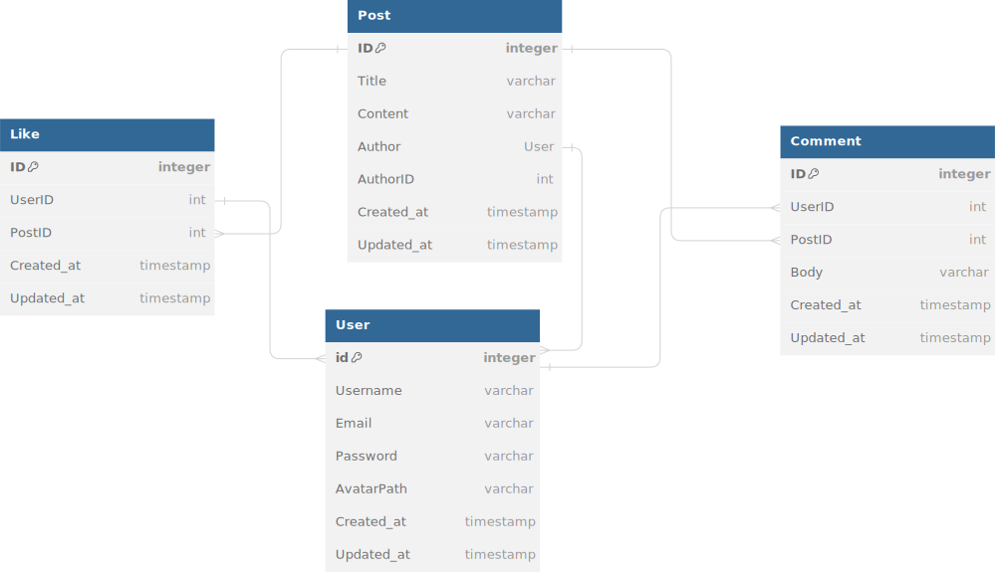

# Go Forum Backend-GH
 Our backend forum project utilizes Golang with the Gin Framework and GORM for efficient and robust web development. We store data in PostgreSQL/MySQL databases, enabling seamless integration and smooth forum functionality.

## Getting Started

> [[Technologies](#technologies-used) &middot;  &middot; [Installations](#installations) &middot; &middot; [Tests](#tests) &middot; [API Docs](#api-docs) &middot; [Main Author](#main-author)


## Technologies Used

[golang]: (https://golang.org)

- [Golang](https://golang.org).
- [Gin Framework](https://github.com/gin-gonic/gin).
- [GORM](http://gorm.io).
- [postgreSQL](https://www.postgresql.org).
- [Docker](https://www.docker.com/).
- [Digital Ocean](https://www.digitalocean.com).
- [AWS](https://aws.amazon.com).
- [Circleci](https://circleci.com).


## Installations

### Clone

- Clone this project to your local machine `https://github.com/Mdromi/go-forum-backend-gh`

### React-Frontend 
`https://github.com/Mdromi/go-forum-frontend-gh`

### Setup

  #### Without Docker

  > Ensure that you have your .env set up and have created your database
  - For local, set the DB_HOST in the .env file as follows:
    ```shell
      $ DB_HOST=127.0.0.1
    ```           
  > In the root directory, run the command
  ```shell
  $ go run main.go
  ```
  - Use `http://localhost:8080` as base url for endpoints


 #### Using Docker

  Docker is the default setting for this project

  - Set the DB_HOST as follows in the .env file
    ```shell
      $ DB_HOST=forum-postgres 
    ```    
  ##### For Local Development:
  - Create a Dockerfile file in the root directory
  - Copy the content of the file: example.Dockerfile.dev (for only local development)
  - Create a docker-compose.yml file in the root directory
  - Copy the content of the file: example.docker-compose.dev.yml (for only local development)

  ##### For Testing:
  - Create a Dockerfile.test file in the root directory
  - Copy the content of the file: example.Dockerfile.test (for only test)
  - Create a docker-compose.test.yml file in the root directory
  - Copy the content of the file: example.docker-compose.test.yml (for only test)
  
  ##### For Production (This should be done in the server (AWS, DigitalOcean, etc)):
  - Create a Dockerfile file in the root directory
  - Copy the content of the file: example.Dockerfile.prod (for production only)
  - Create a docker-compose.yml file in the root directory
  - Copy the content of the file: example.docker-compose.prod.yml (for production only)

  
  In the root directory, run the command:
  ```shell
  $ docker-compose up --build
  ```
  - Use `http://localhost:8888` as base url for endpoints


## Tests

  ### Without Docker

  - Run test for all endpoints
    > Navigate to the tests directory and run
    ```shell
    $ go test -v ./...
    ```

  ### Using Docker

- Run test for all endpoints
  > If you have set up the Dockerfile.test and the docker-compose.test.yml files above, from the root directory of the app.
  ```shell
  $ docker-compose -f docker-compose.test.yml up --build 
  ```


## Database Models Relationship
<div align="center">
    
</div>

## API Docs
1. Login Route
    ```
    Path: /api/v1/login
    Method: POST
    ```

2. Reset Password
    ```
    Path: /api/v1/password/forgot
    Method: POST
    ```

3. Reset Password
    ```
    Path: /api/v1/password/reset
    Method: POST
    ```

4. Users Routes

    - Create User
        ```
        Path: /api/v1/users
        Method: POST
        ```

    - Get All Users
        ```
        Path: /api/v1/users
        Method: GET
        ```

    - Get User by ID
        ```
        Path: /api/v1/users/:id
        Method: GET
        ```

    - Update User by ID
        ```
        Path: /api/v1/users/:id
        Method: PUT
        ```

    - Update User Avatar by ID
        ```
        Path: /api/v1/avatar/users/:id
        Method: PUT
        ```

    - Delete User by ID
        ```
        Path: /api/v1/users/:id
        Method: DELETE
        ```


5. Posts Routes
    
    - Create Post
        ```
        Path: /api/v1/posts
        Method: POST
        ```

    - Get All Posts
        ```
        Path: /api/v1/posts
        Method: GET
        ```

    - Get Post by ID
        ```
        Path: /api/v1/posts/:id
        Method: GET
        ```

    - Update Post by ID
        ```
        Path: /api/v1/posts/:id
        Method: PUT
        ```

    - Delete Post by ID
        ```
        Path: /api/v1/posts/:id
        Method: DELETE
        ```

    - Get User Posts by ID
        ```
        Path: /api/v1/user_posts/:id
        Method: GET
        ```

6. Like Routes

    - Get Likes for a Post
        ```
        Path: /api/v1/likes/:id
        Method: GET
        ```

    - Like a Post
        ```
        Path: /api/v1/likes/:id
        Method: POST
        ```

    - Unlike a Post
        ```
        Path: /api/v1/likes/:id
        Method: DELETE
        ```


7. Comment Routes

    - Create Comment for a Post
        ```
        Path: /api/v1/comments/:id
        Method: POST
        ```

    - Get Comments for a Post
        ```
        Path: /api/v1/comments/:id
        Method: GET
        ```

    - Update Comment by ID
        ```
        Path: /api/v1/comments/:id
        Method: PUT
        ```

    - Delete Comment by ID
        ```
        Path: /api/v1/comments/:id
        Method: DELETE
        ```

## [Main Author](https://github.com/victorsteven/Forum-App-Go-Backend)

- Steven Victor
- medium: medium.com/@victorsteven  
- twitter: twitter.com/stevensunflash  
- linkedin: linkedin.com/in/stevenchikodi